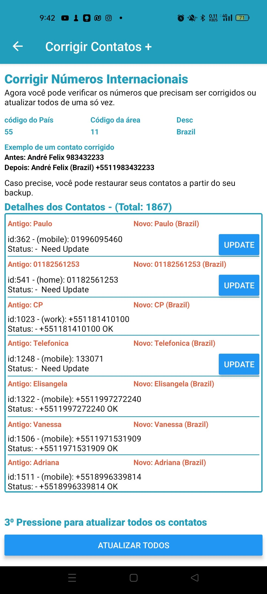
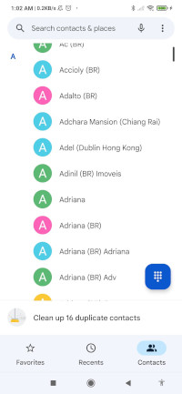

# Contact Plus 
[Veja em PT](README.md)

## Your Contact list became a mess after you change of country? Why?

When we move from one country to another and our contacts don't have the international code like +55 (Brazil), +1 (USA), + 66 (Thailand) etc, your android and apps like _Whatsapp, Line, Telegram_ start to see the number as a local number of country that you are and it is worst when you need to reinstall the whatsapp, because your messages you be mixed with a lot numbers/contacts that you never saw in your life.

What is happening is your contact in your contact list, Google or whatever is saved without the international code from Brazil or other country where you got the contact. So if you save your contact as Felipe, number 119 8764 2232 in São Paulo, when you move to another country for example, Ireland, it becomes, Felipe +353 11987642232, +353 is the country code for Ireland, and so on.

 | 
 | 
 | 
 |
 |

You can process contact by contact or fix all the contacts at once. OK, think that basically your contacts without an country code must come from your origin country.

When the app finish process if your contacts of your origin country, in my case Brazil will receive the code +55 and 11 for the city of São Paulo. New improvements about cities and list of countries are wellcome.

 | 

## Need to Improve
* List of cities 
* list of countries codes (It is possible to identify the countries when we type the code, inserting automatically the flag and the description).
* Update the View to FlatList to visualize many contacts
* Improve the input text to allow nulls on ON|OFF
 

