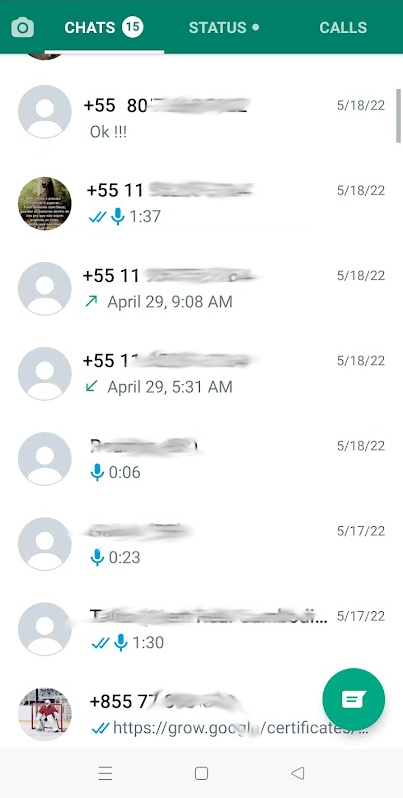
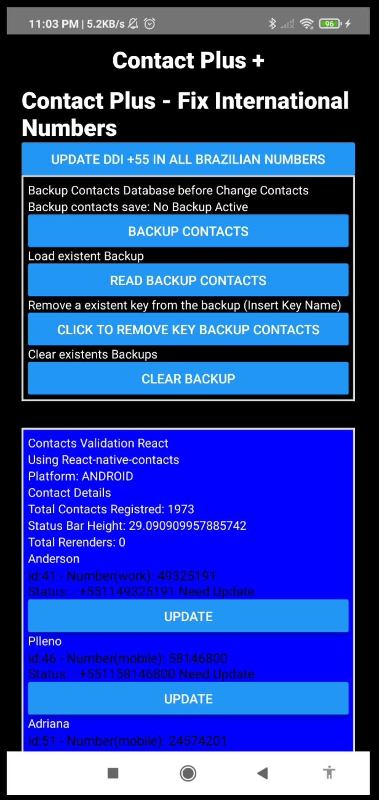
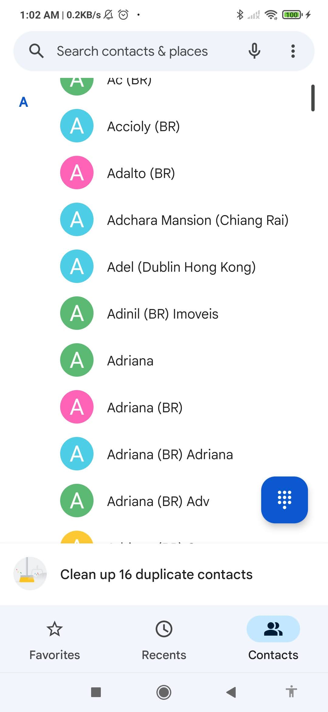

# Contact Plus [EN](README.en.md)

## Sua lista de contatos ficou uma bagunça depois que você mudou de país? Por quê?

Quando nos mudamos de um país para outro e nossos contatos não possuem o código internacional como +55 (Brasil), +1 (EUA), + 66 (Tailândia) etc, seu android e aplicativos como _Whatsapp, Line, Telegram_ começam a veja o número como um número local do país que você está e é pior quando você precisa reinstalar o whatsapp, pois suas mensagens ficam misturadas com muitos números/contatos que você nunca viu na vida.

O que está acontecendo é seu contato na sua lista de contatos, Google ou o que for salvo sem o código internacional do Brasil ou de outro país onde você conseguiu o contato. Então, se você salvar seu contato como Felipe, número 119 8764 2232 em São Paulo, quando você se mudar para outro país, por exemplo, Irlanda, ele se torna Felipe +353 11987642232, +353 é o código do país para a Irlanda, e assim por diante.

<video src="readmefiles/contactplus.mp4" >

Você pode processar contato por contato ou corrigir todos os contatos de uma só vez. OK, pense que basicamente seus contatos sem um código de país devem vir do seu país de origem.

Quando o aplicativo finalizar o processo se seus contatos do seu país de origem, no meu caso o Brasil receberá o código +55 e 11 para a cidade de São Paulo. Novas melhorias sobre cidades e lista de países são bem-vindas.

 

## Precisa melhorar
* Lista de cidades
* lista de códigos de países.
 

